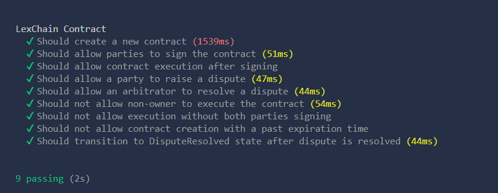

# 📝 LexChain: Exploring Blockchain for Legal Contracts

Welcome to **LexChain**! This project is a **proof of concept (POC)** designed to explore how **blockchain technology** can be applied to the management of legal contracts. It is not intended to be used in production environments, but rather serves as a personal exploration into the potential of using blockchain for increasing transparency, security, and traceability in legal agreements.

<p align="center">
  
  
  
  
  
  
</p>

## ⚠️ Disclaimer

**LexChain** is an experimental project and should be considered a **proof of concept** rather than a fully developed product. It aims to investigate the possibility of using blockchain technology to manage legal contracts in a secure, transparent, and immutable way.

## 🌟 Key Features of LexChain:

* 🔒 **Blockchain-based Security**: LexChain leverages **smart contracts** on the Ethereum blockchain to store and manage legal agreements. This ensures **immutable** and **tamper-proof** records, protecting the integrity of contracts and reducing the risk of fraud or unauthorized changes. Once stored, contracts cannot be altered without the consent of all involved parties, ensuring a high level of security.
  
* 🕵️ **Transparent Tracking of Signatures**: LexChain enables **real-time tracking** of contract signatures from all involved parties, allowing everyone to easily verify the status of the contract. This feature promotes **accountability** and provides full visibility into the contract lifecycle, making it easier to ensure that all parties have agreed to the terms.

* ⏰ **Contract Expiration**: LexChain allows for the integration of **expiration times** on contracts, ensuring that agreements are executed within defined timeframes. This feature ensures that if contracts are not executed before their expiration, they automatically become void, reducing the potential for missed deadlines or stale agreements.

* ⚖️ **Dispute Resolution**: In case of disagreements or breaches of contract, LexChain includes a **built-in framework** for **raising and resolving disputes**. The system allows for the involvement of an **arbitrator** to review the issue and make a decision, ensuring that both parties have a fair avenue for resolving conflicts and that the contract’s terms are upheld.


## 📝 Purpose

The primary goal of **LexChain** is to **explore** how **blockchain technology** can revolutionize the management of **legal contracts** by increasing efficiency, security, and transparency. Key aspects under evaluation include:

- **Automating Contract Lifecycle**: By using smart contracts, LexChain aims to automate key stages of the contract process, such as signing, execution, and enforcement. This reduces human error and the need for intermediaries, making the process more efficient.
  
- **Tracking Changes Transparently**: With blockchain’s immutable nature, every update or change made to a contract is recorded and timestamped, ensuring full transparency. This creates a permanent, auditable trail that can be easily reviewed by any party involved.
  
- **Dispute Resolution Mechanism**: LexChain tests the ability of blockchain technology to support decentralized dispute resolution, where an arbitrator or mediator can be involved without relying on traditional legal processes. This ensures faster resolution, lower costs, and a more equitable approach to conflict resolution.

- **Enhancing Legal Frameworks**: This project aims to demonstrate how blockchain can complement and improve current legal practices, providing a modern alternative to paper-based and manual processes in managing contracts.


## 🛠️ Installation
First, clone the repository:

```bash
git clone https://github.com/sergio11/lexchain_blockchain.git
cd lexchain_blockchain
```

Install the necessary dependencies:

```bash
npm install
```

## 📜 Usage

**LexChain** is currently deployed and tested on the **Ethereum test networks**, offering a platform for experimenting with **contract creation**, the **signing process**, **dispute resolution**, and **contract execution**.

### Key Actions in LexChain:
- **Create Contract**: Initiate a legal agreement by creating a contract that involves two parties. Specify the terms, expiration time, and contract details, including a document hash to represent the contract’s content.
  
- **Sign Contract**: Both **partyA** and **partyB** must sign the contract. Once both parties have signed, the contract transitions into a "Signed" state, marking mutual consent.
  
- **Execute Contract**: After both parties sign the contract, the **contract owner** can execute the contract. This action changes the state to "Executed," signaling that the terms have been fulfilled.
  
- **Dispute Resolution**: If either party raises a dispute, the system allows the involvement of an **arbitrator** to resolve the conflict. This feature provides a decentralized mechanism for fair conflict resolution, ensuring that both parties have an avenue to voice concerns and seek solutions.

## ⚙️ Smart Contracts

LexChain uses **Solidity** to build the core of the system: the **smart contracts**. These contracts run on the **Ethereum blockchain**, ensuring data integrity, transparency, and security for all contract activities, such as signing, executing, and resolving disputes.

The smart contracts also ensure the contracts are immutable once signed, providing both parties with a level of security and trust throughout the contract's lifecycle.

### LexChain Smart Contract (Solidity Example):

```solidity
// SPDX-License-Identifier: MIT
pragma solidity ^0.8.19;

import "./ILexChain.sol";

/**
 * @title LexChain
 * @dev A smart contract to manage legal agreements with transparency and immutability.
 * This contract enables parties to create, sign, and execute legally binding agreements
 * on the Ethereum blockchain, ensuring security and transparency.
 */
contract LexChain is ILexChain {
    /**
     * @dev Struct representing a legal contract.
     * @param owner The creator of the contract.
     * @param partyA The first signing party.
     * @param partyB The second signing party.
     * @param documentHash IPFS hash of the agreement document.
     * @param state Current state of the contract.
     * @param expirationTime Time by which the contract must be signed/executed.
     */
    struct Contract {
        address owner;
        address partyA;
        address partyB;
        string documentHash;
        State state;
        mapping(address => bool) signatures;
        bool disputeRaised;
        address disputeResolution;
        uint256 expirationTime;
    }


    // Contract implementation

}
```

## 🧪 Testing

Testing is a critical part of this project to ensure the functionality and reliability of the system. It verifies that **contract creation**, **signing**, **dispute resolution**, and **contract execution** work as expected. The tests are designed to simulate different scenarios and ensure the smart contracts behave correctly in real-world use cases.

### Running Tests

The tests are executed to validate that the core functionalities of LexChain—such as **signing**, **executing**, and **handling disputes**—are functioning correctly. The goal is to ensure that each action, from contract creation to dispute resolution, operates as intended under various conditions.

### Running the Tests
To run the tests, use the following command:

```shell
npx hardhat test
```

This command will execute all the test scripts located in the test directory, and you should see output similar to the following:



## 📜 Roadmap

- **Phase 1: Contract Creation & Signing**:  
  Focus on developing and testing the ability to create contracts and facilitate the signing process. This phase will include creating contracts, adding terms, and transitioning contracts into a "Signed" state.

- **Phase 2: Dispute Handling**:  
  Develop and test dispute resolution mechanisms. This phase involves adding functionality to raise disputes and resolving them via an arbitrator, ensuring fairness and transparency in the process.

- **Phase 3: Contract Execution**:  
  Once contracts are signed, this phase enables the execution of contracts. It ensures that contracts can be executed only once all parties have signed, and the system updates the contract status to "Executed."

- **Phase 4: Evaluation and Improvements**:  
  Analyze the system’s performance and its use in legal processes. Based on findings, this phase will focus on optimizing the system and making improvements to enhance its overall efficiency and user experience.

## Visitors Count


